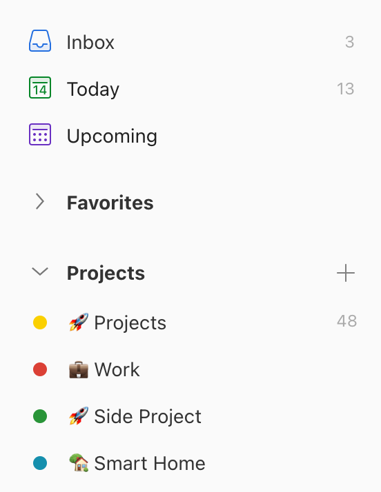
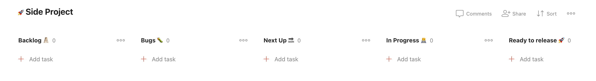
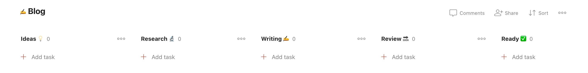
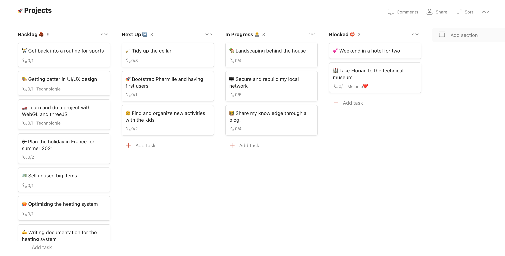

I use Todoist since 2015 and there is a lot of way you can organize tasks. Does not matter which system you follow. There is maybe something you can take from this setup.

## Todoist Projects

Everything starts with my Areas of Focus. Those could be anything which does not end. For example this Blog, my Work, my Hobby (Smart Home), my Family or simply Myself. I found **Todoist Projects** being the best for this.

## Todoist Sections

Those areas can have different flow. The blog tasks will go from idea to draft to ready to published while my work will go from Backlog to Next Up to In Progress or Blocked. [Todoist Section](https://todoist.com/help/articles/introduction-to-sections) is perfect to display this flow. I can drag and drop easily the task between section which allow me changing easily the state of the project. [The Board view](https://todoist.com/help/articles/visualize-your-workflow-with-board-view) make it even better !

I decided to use those state instead of a time based setup (like this week, next week, this month, next month) because I don't want to feel bad postponing a project. It is already hard to postpone a task from the Today view.

When it comes to review my projects I will have questions based on the state of the projects.

- Blocked: Does it still blocked, can I do anything to unblock it ?
- In Progress: Is the next task defined ?
- Next Up: Can I start or do I want to start this now ?
- Backlog: Does the order still represent the priority I want to give to those projects ?

I will prioritize the questions depending on the type of review. For example during the daily review I won't look at the Backlog.

## Todoist Tasks

I am using the [Todoist feature uncompletable tasks](https://todoist.com/help/articles/how-to-create-an-uncompletable-task) representing my projects. When we are in the Area of Focus Blog, the project can be "My Todoist Setup 2021". When we are in my personal projects it can be "Landscaping behind my house".

The subtasks section will contain all tasks making the project going forward. The comment section will have all ephemeral information because I will write in my note/wiki app the information which need to stay for ever.

## Todoist Filters

During my review it can happen I want to see all projects in progress independently of the area. For that I create a filter like `/In Progress* & !subtask`. The same for blocked or Next Up section. [Todoist filters](https://todoist.com/help/articles/introduction-to-filters) are views for your setup. It is as well possible to see all subtask for your projects in progress with `/In Progress* & subtask`.

If project has a deadline. You can add a date to the uncompletable task and using a filter like `before: 1st & !subtask & #🚀 Projects`. This will give you the list of projects to finish this month.

Filters are so powerful when you know what you want to display !

## The idea behind this Setup

Using this setup allows me to have the following benefits:

- Having Micro and Macro views of my projects and tasks
- Make sure I work on the right tasks/projects
- Having views for my reviews allowing me to focus on the right questions
- Easily manage projects state by a simple drag and drop.

Depending on Todoist new features this Setup can even become better.

This is it. I really hope you will be able to use something from this post. bi
